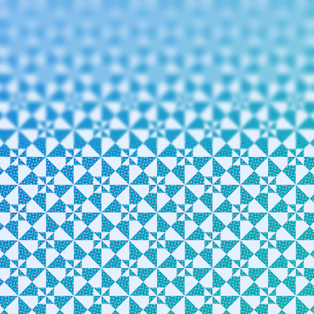
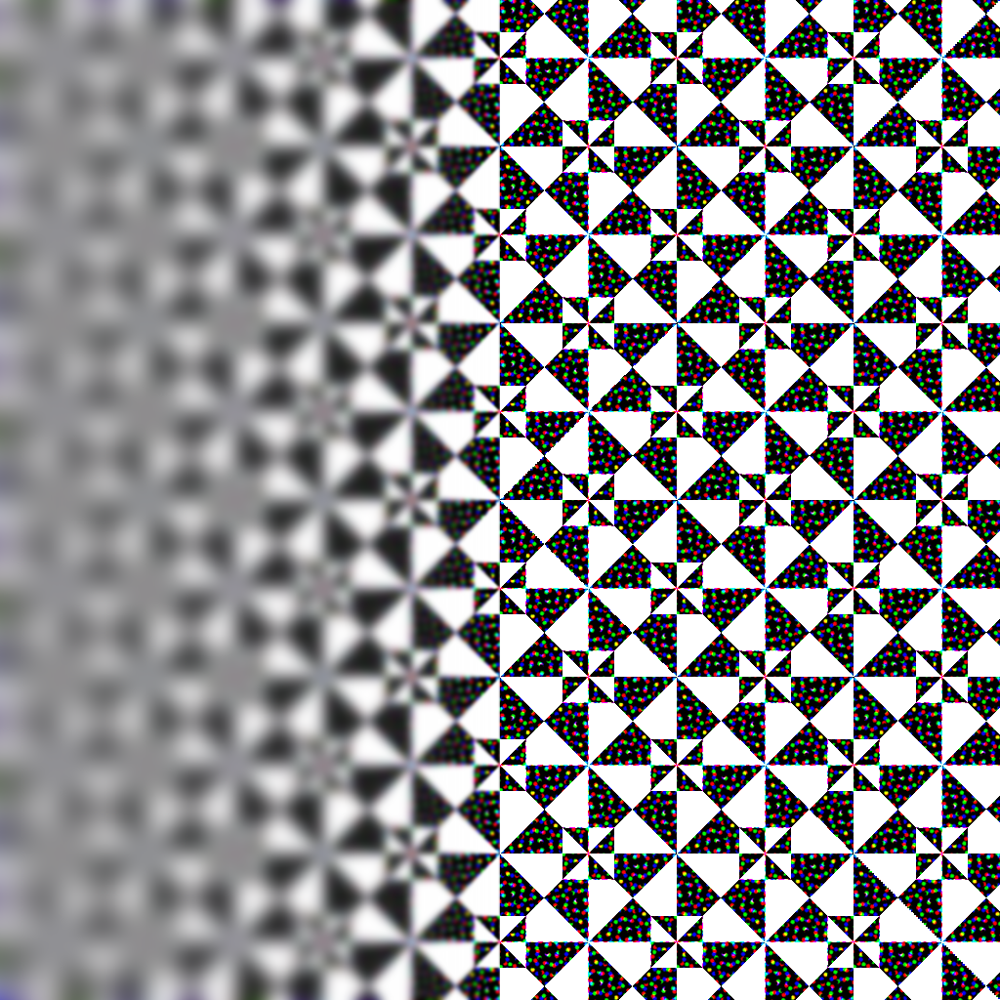
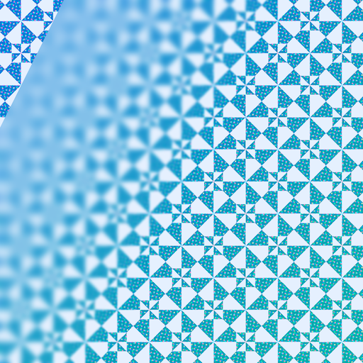

# VariableBlurImageView

Framework for adding variable blur, or progressive blur, to images on iOS and MacCatalyst. Works with UIKit using Metal.

-to-(50w,0).png)

> Left image has a horizontal variable blur from the leading edge to the middle. Right image has a vertical variable blur from the top edge to the middle.

## Table of contents
   * [Installation](#installation)
   * [Usage](#usage)
      * [VariableBlurImageView](#variableblurimageview-1)
      * [VariableBlur](#variableblur)
   * [Roadmap](#roadmap)
   * [Project Organization](#project-organization)
      * [Implementing new blur types](#implementing-new-blur-types)
   * [Contributing to VariableBlurImageView](#contributing-to-variableblurimageview)

## Installation
To use this package in a SwiftPM project, you need to set it up as a package dependency:

```swift
// swift-tools-version:5.9
import PackageDescription

let package = Package(
  name: "MyPackage",
  dependencies: [
    .package(
      url: "https://github.com/Eskils/VariableBlurImageView", 
      .upToNextMinor(from: "1.0.0") // or `.upToNextMajor
    )
  ],
  targets: [
    .target(
      name: "MyTarget",
      dependencies: [
        .product(name: "VariableBlurImageView", package: "VariableBlurImageView")
      ]
    )
  ]
)
```

## Usage

This frameworks provides an UIImageView subclass and a class to apply variable blur to CGImages.

The following types are supported: 
  - Vertical  
  
  - Horizontal  
  
  - Between two points  


### VariableBlurImageView
VariableBlurImageView is a subclass of `UIImageView` which asynchronously applies the wanted progressive blur.

You provide an image, start point, end point, and their respective blur radiuses.

#### Example
```swift
let imageView = VariableBlurImageView()
imageView.contentMode = .scaleAspectFill
let backgroundImage = UIImage(resource: .onboardingBackground)
imageView.verticalVariableBlur(
    image: backgroundImage, 
    startPoint: 0, 
    endPoint: backgroundImage.size.height / 4, 
    startRadius: 15, 
    endRadius: 0
)
```


#### Vertical 
```swift
public func verticalVariableBlur(
    image: UIImage, 
    startPoint: CGFloat, 
    endPoint: CGFloat, 
    startRadius: CGFloat, 
    endRadius: CGFloat
)
```

#### Horizontal 
```swift
public func horizontalVariableBlur(
    image: UIImage, 
    startPoint: CGFloat, 
    endPoint: CGFloat, 
    startRadius: CGFloat, 
    endRadius: CGFloat
)
```

#### Between two points 
```swift
public func variableBlur(
    image: UIImage, 
    startPoint: CGPoint, 
    endPoint: CGPoint, 
    startRadius: CGFloat, 
    endRadius: CGFloat
)
```

### VariableBlur

VariableBlur is an object used to apply progressive blur to CGImages.

You provide a CGImage, start point, end point, and their respective blur radiuses. A new CGImage is returned with the variable blur effect.

#### Example

```swift
let variableBlur = VariableBlur()
let leavesImage = UIImage(resource: .leaves)
let blurredImage = variableBlur.applyVerticalVariableBlur(
    toImage: leavesImage, 
    startPoint: 0, 
    endPoint: leavesImage.size.height / 4, 
    startRadius: 15, 
    endRadius: 0
)
```


#### Vertical

```swift
public func applyVerticalVariableBlur(
    toImage image: CGImage, 
    startPoint: CGFloat, 
    endPoint: CGFloat, 
    startRadius: CGFloat, 
    endRadius: CGFloat
) throws -> CGImage
```

#### Horizontal

```swift
public func applyHorizontalVariableBlur(
    toImage image: CGImage, 
    startPoint: CGFloat, 
    endPoint: CGFloat, 
    startRadius: CGFloat, 
    endRadius: CGFloat
) throws -> CGImage
```

#### Between two points

```swift
public func applyVariableBlur(
    toImage image: CGImage, 
    startPoint: CGPoint, 
    endPoint: CGPoint, 
    startRadius: CGFloat, 
    endRadius: CGFloat
) throws -> CGImage
```

## Roadmap
- macOS Support
- SwiftUI support
- Variable blur for array of ranges
- Providing grayscale image to use for controlling blur
- Separable Gaussian Blur (Performance optimization)
- Looking into applying variable blur to other UIViews

## Project Organization
This framework is written in Swift and Metal.

*VariableBlurImageView* is the primary framework.  
*GenerateTestImages* is a small executable used to produce images to test against.

The tests for VariableBlurImageView check if the current state of the code produce the same set of images as has previously been generated by `GenerateTestImages`. 

When implementing altering the look of an existing blur type, expect the tests to fail. Running `GenerateTestImages` from Xcode will produce new images and make the tests succeed.

When working on performance improvements, the tests should ideally not fail.

### Implementing new blur types

When implementing a new blur type, new tests and generating methods need to be provided.

#### Supplying tests
Generally, at least two tests are written for each blur type — one to check if the images produced are as expected, and one to measure performance.

Checking similarity can be done with the `ìsEqual(inputImageName:expectedImageName:afterPerformingImageOperations:)` method, like so:

```swift
func testVerticalVariableBlur() throws {
    XCTAssertTrue(
        try isEqual(
            inputImageName: inputImageName,
            expectedImageName: "\(inputImageName)-VerticalBlur...",
            afterPerformingImageOperations: { input in
                try variableBlur.applyVerticalVariableBlur(
                    toImage: input,
                    startPoint: 0,
                    endPoint: CGFloat(input.height / 2),
                    startRadius: 20,
                    endRadius: 0
                )
            }
        )
    )
}
```

Measuring performance can be done with the `provideInputImage(inputImageName:)` and `measure` methods, like so:

```swift
func testPerformanceOfVerticalVariableBlur() throws {
    let inputImage = try provideInputImage(inputImageName: inputImageName)
    measure {
        _ = try! variableBlur.applyVerticalVariableBlur(
            toImage: inputImage,
            startPoint: 0,
            endPoint: CGFloat(inputImage.height / 2),
            startRadius: 20,
            endRadius: 0
        )
    }
}
```

#### Generate images to use in the test

The `GenerateImages.swift` file in *GenerateTestImages* provides the implementation to generate images.

Use the `from(image:named:performingOperations:)` method on OutputImage, and add the result to the `outputImages` array. The entries in this array are written to the *ExpectedOutputs* directory under Tests.

```swift
// Vertical blur
OutputImage
    .from(image: inputImage, named: "\(name)-Vertical...") { input in
        try variableBlur.applyVerticalVariableBlur(
            toImage: input,
            startPoint: 0,
            endPoint: CGFloat(input.height / 2),
            startRadius: 20,
            endRadius: 0
        )
    }?
    .adding(to: &outputImages)
```

## Contributing to VariableBlurImageView

Contributions are welcome and encouraged. Feel free to check out the project, submit issues and code patches.