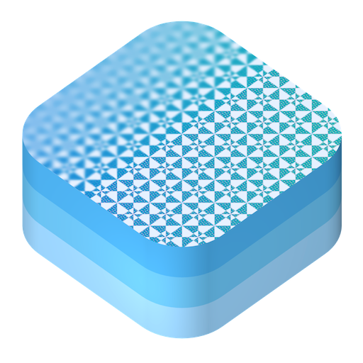

# VariableBlurImageView

Add variable blur to images in UIKit, AppKit, and SwiftUI. Works on Apple platforms using Metal.

-to-(50w,0).png)

> Left image has a horizontal variable blur from the leading edge to the middle. Right image has a vertical variable blur from the top edge to the middle.

Demo apps for SwiftUI, UIKit and AppKit are available under [Documentation](/Documentation/).

## Table of contents
   * [Possible kinds](#possible-kinds)
   * [Requirements](#requirements)
   * [Installation](#installation)
   * [Usage](#usage)
      * [Working with UIKit and AppKit](#working-with-uikit-and-appkit)
      * [Working with SwiftUI](#working-with-swiftui)
      * [Working with CGImages](#working-with-cgimages)
   * [Roadmap](#roadmap)
   * [Project Organization](#project-organization)
   * [Implementing new blur types](#implementing-new-blur-types)
      * [Steps to implement a new blur type](#steps-to-implement-a-new-blur-type)
      * [Supplying tests](#supplying-tests)
      * [Generate images to use in the test](#generate-images-to-use-in-the-test)
   * [Contributing to VariableBlurImageView](#contributing-to-variableblurimageview)

## Possible kinds
 
| Vertical | Horizontal | Between two points | Gradient | Multiple blurs |
|----------|------------|--------------------|----------|----------------|
 |  |  |  | 

## Requirements
- Swift 5.9
- iOS 13.0
- macOS 11.0
- tvOS 13.0
- macCatalyst 13.0

## Installation
To use this package in a SwiftPM project, you need to set it up as a package dependency:

```swift
// swift-tools-version:5.9
import PackageDescription

let package = Package(
  name: "MyPackage",
  dependencies: [
    .package(
      url: "https://github.com/Eskils/VariableBlurImageView", 
      .upToNextMinor(from: "1.1.2") // or `.upToNextMajor
    )
  ],
  targets: [
    .target(
      name: "MyTarget",
      dependencies: [
        .product(name: "VariableBlurImageView", package: "VariableBlurImageView")
      ]
    )
  ]
)
```

## Usage

This frameworks provides subclasses for UIImageView, and NSImageView, in addition to SwiftUI views and modifiers to apply variable blur to images.

There is also a class to apply variable blur to CGImages.

### Working with UIKit and AppKit
`VariableBlurImageView` is a subclass of `UIImageView` / `NSImageView` which asynchronously applies the wanted progressive blur.

You provide an image, start point, end point, and their respective blur radiuses.

#### Example
```swift
let imageView = VariableBlurImageView()
imageView.contentMode = .scaleAspectFill
let backgroundImage = UIImage(resource: .onboardingBackground)
imageView.verticalVariableBlur(
    image: backgroundImage, 
    startPoint: 0, 
    endPoint: backgroundImage.size.height / 4, 
    startRadius: 15, 
    endRadius: 0
)
```


#### Available methods

```swift
/// Adds a vertical variable blur to your image.
VariableBlurImageView.verticalVariableBlur(image:startPoint:endPoint:startRadius:endRadius:)

/// Adds a horizontal variable blur to your image.
VariableBlurImageView.horizontalVariableBlur(image:startPoint:endPoint:startRadius:endRadius:)

// Adds a variable blur between two points to your image.
VariableBlurImageView.variableBlur(image:startPoint:endPoint:startRadius:endRadius:)

/// Adds a variable blur following the lightness in the provided gradient image.
VariableBlurImageView.gradientBlur(image:gradient:maxRadius:)

/// Adds multiple variable blurs
VariableBlurImageView.mutlipleBlurs(image:descriptions:)
```

### Working with SwiftUI

Views and View Modifiers on `Image` are available to asynchronously apply the wanted progressive blur.

You provide an image, start point, end point, and their respective blur radiuses.

> **NOTE:** The ViewModifiers are only available from iOS 16.0 and macOS 13.0, and do not support image variations (e.g. dark mode images) 

#### Example
```swift
let backgroundImage = UIImage(resource: .onboardingBackground)

var body: some View {
    VStack {
        VerticalVariableBlurImage(
            image: backgroundImage, 
            startPoint: 0, 
            endPoint: backgroundImage.size.height / 4, 
            startRadius: 15, 
            endRadius: 0
        )
    }
}
```

#### Available Views

```swift
/// Adds a vertical variable blur to your image.
VerticalVariableBlurImage(image:startPoint:endPoint:startRadius:endRadius:)

/// Adds a horizontal variable blur to your image.
HorizontalVariableBlurImage(image:startPoint:endPoint:startRadius:endRadius:)

// Adds a variable blur between two points to your image.
VariableBlurImage(image:startPoint:endPoint:startRadius:endRadius:)

/// Adds a variable blur following the lightness in the provided gradient image.
GradientBlurImage(image:gradient:maxRadius:)

/// Adds multiple variable blurs
MultipleBlursImage(image:descriptions:)
```

#### Available Image ViewModifiers

```swift
/// Adds a vertical variable blur to your image.
Image.verticalVariableBlur(startPoint:endPoint:startRadius:endRadius:)

/// Adds a horizontal variable blur to your image.
Image.horizontalVariableBlur(startPoint:endPoint:startRadius:endRadius:)

// Adds a variable blur between two points to your image.
Image.variableBlur(startPoint:endPoint:startRadius:endRadius:)

/// Adds a variable blur following the lightness in the provided gradient image.
Image.gradientBlur(gradient:maxRadius:)

/// Adds multiple variable blurs
Image.mutlipleBlurs(descriptions:)
```

### Working with CGImages

`VariableBlurEngine` is an object used to apply progressive blur to CGImages.

You provide a CGImage, start point, end point, and their respective blur radiuses. A new CGImage is returned with the variable blur effect.

#### Example

```swift
let variableBlurEngine = VariableBlurEngine()
let leavesImage = UIImage(resource: .leaves)
let blurredImage = variableBlurEngine.applyVerticalVariableBlur(
    toImage: leavesImage, 
    startPoint: 0, 
    endPoint: leavesImage.size.height / 4, 
    startRadius: 15, 
    endRadius: 0
)
```


#### Available methods

```swift
/// Adds a vertical variable blur to your image.
VariableBlurEngine.applyVerticalVariableBlur(image:startPoint:endPoint:startRadius:endRadius:)

/// Adds a horizontal variable blur to your image.
VariableBlurEngine.applyHorizontalVariableBlur(image:startPoint:endPoint:startRadius:endRadius:)

// Adds a variable blur between two points to your image.
VariableBlurEngine.applyVariableBlur(image:startPoint:endPoint:startRadius:endRadius:)

/// Adds a variable blur following the lightness in the provided gradient image.
VariableBlurEngine.applyGradientVariableBlur(image:gradient:maxRadius:)

/// Adds multiple variable blurs
VariableBlurEngine.applyMultipleVariableBlurs(image:descriptions:)
```

## Roadmap
- Separable Gaussian Blur (Performance optimization)
- Looking into applying variable blur to other UIViews

## Project Organization
This framework is written in Swift and Metal.

*VariableBlurImageView* is the primary framework.  
*GenerateTestImages* is a small executable used to produce images to test against.

The tests for VariableBlurImageView check if the current state of the code produce the same set of images as has previously been generated by `GenerateTestImages`. 

When implementing altering the look of an existing blur type, expect the tests to fail. Running `GenerateTestImages` from Xcode will produce new images and make the tests succeed.

When working on performance improvements, the tests should ideally not fail.

## Implementing new blur types

When implementing a new blur type, new tests and generating methods need to be provided.

### Steps to implement a new blur type
- Write a new kernel function in Metal
- Provide a new method in *VariableBlurMetal.swift* to dispatch metal function
  - Functions are precompiled lazily 
  - Buffers are made lazily, to be reused
  - A kernel function has an input texture and an output texture.
  - You may use `variableBlurGeneric(_:image:bufferConfigurationHandler:)`.
- Write a new method in *VariableBlurEngine.swift*
- Write a new method in *VariableBlurImageView.swift*
  - Write a `X-variableBlurImpl` method in the extension for both iOS and macOS
  - You may use the `transformAllVariations(ofImage:variationTransformMode:applyingTransform:)` method.
  - Write a new method in the UIImageView subclass using `UIImage`.
  - Write a new method in the NSImageView subclass using `NSImage`.
    - Set the `originalImage` and `blurOperation` properties.
- Add a new case to *VariableBlurOperation.swift*
- Add a new View in *SwiftUI/VariableBlurImage.swift*
  - Provide separate initializers for UIImage and NSImage.
- Add a new Image modifier to *SwiftUI/Image+Extension.swift*
- Write new generating methods in `GenerateTestImages`. See [Generate images to use in test](#generate-images-to-use-in-the-test)
- Write new tests. See [Supplying tests](#supplying-tests)
- Update docc documentation with new images, and method overview
- Update README with new images, and method overview

### Supplying tests
Generally, at least two tests are written for each blur type — one to check if the images produced are as expected, and one to measure performance.

Checking similarity can be done with the `ìsEqual(inputImageName:expectedImageName:afterPerformingImageOperations:)` method, like so:

```swift
func testVerticalVariableBlur() throws {
    XCTAssertTrue(
        try isEqual(
            inputImageName: inputImageName,
            expectedImageName: "\(inputImageName)-VerticalBlur...",
            afterPerformingImageOperations: { input in
                try variableBlurEngine.applyVerticalVariableBlur(
                    toImage: input,
                    startPoint: 0,
                    endPoint: CGFloat(input.height / 2),
                    startRadius: 20,
                    endRadius: 0
                )
            }
        )
    )
}
```

Measuring performance can be done with the `provideInputImage(inputImageName:)` and `measure` methods, like so:

```swift
func testPerformanceOfVerticalVariableBlur() throws {
    let inputImage = try provideInputImage(inputImageName: inputImageName)
    measure {
        _ = try! variableBlurEngine.applyVerticalVariableBlur(
            toImage: inputImage,
            startPoint: 0,
            endPoint: CGFloat(inputImage.height / 2),
            startRadius: 20,
            endRadius: 0
        )
    }
}
```

### Generate images to use in the test

The `GenerateImages.swift` file in *GenerateTestImages* provides the implementation to generate images.

Use the `from(image:named:performingOperations:)` method on OutputImage, and add the result to the `outputImages` array. The entries in this array are written to the *ExpectedOutputs* directory under Tests.

```swift
// Vertical blur
OutputImage
    .from(image: inputImage, named: "\(name)-Vertical...") { input in
        try variableBlurEngine.applyVerticalVariableBlur(
            toImage: input,
            startPoint: 0,
            endPoint: CGFloat(input.height / 2),
            startRadius: 20,
            endRadius: 0
        )
    }?
    .adding(to: &outputImages)
```

## Contributing to VariableBlurImageView

Contributions are welcome and encouraged. Feel free to check out the project, submit issues and code patches.
